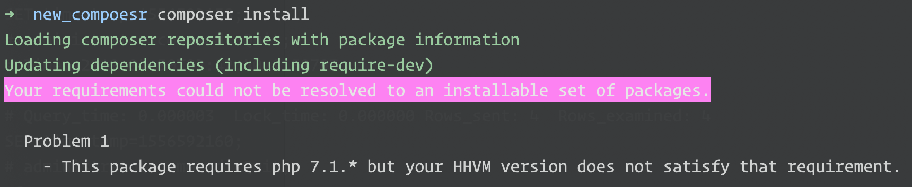
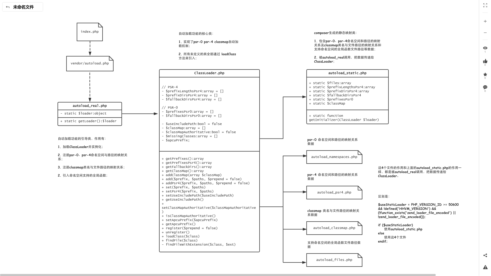

# composer基础

#### 概念

任何一个包含 composer.json 文件的目录都可以视为一个包。

整个项目可以称为**主包**，vendor 目录下的包可以称为**子包**。

#### 平台包

This includes PHP itself, PHP extensions and some system libraries.

eg.  `php` `hhvm` `ext-<name>` `lib-<name>`

如果系统当前安装的 php 版本不符合 composer.json 中版本约束规则的话，执行 `composer install` 或者 `composer update` 时，就会报错：



可以用 `composer show --platform` 命令查看当前系统已安装的平台包及其版本。

> 注意：子包中的 composer.json 也可以定义平台包的版本约束规则。

#### 自动加载

composer 的自动加载机制见下图：



通过主包或子包 composer.json 的 `autoload` 和 `autoload-dev` 字段，可以注册 psr0/psr4/classmap/file autoloader 到 composer 中，起始路径为主包根目录或子包根目录。

> 添加autoload后，记得执行 `composer dump-autoload`

此外，还可以动态注册命名空间：

```php
$loader = require __DIR__ . '/vendor/autoload.php';
$loader->addPsr4('Acme\\Test\\', __DIR__);
```

#### 自动加载优化

当我们通过 composer.json 注册 psr0/psr4 并执行了 `composer dump-autoload` 后，composer 会注册命名空间和路径的映射关系。composer 的 autloader 会根据这些映射关系拼接路径查找 file 并 include。但是，这个查找的过程，会执行 file_exists 这样的操作，有io时间上的消耗。

为了优化自动加载，减少加载时间，composer 提供了针对自动加载的优化，可以通过下面三种方式中的任意一种实现：

- Set `"optimize-autoloader": true` inside the config key of composer.json
- Call `install` or `update` with `-o` / `--optimize-autoloader`
- Call `dump-autoload` with `-o` / `--optimize`

其原理就是生成 classmap，当加载一个类时，可以直接获得它的准确文件路径，省去了查找的过程。而且，在PHP 5.6+ ，这些 classmap 会被缓存到 opcache。

这其中有个问题就是：它并不记录自动加载失败的情况。如果未能在classmap中找到某个类，fallback 机制仍然会走上述的查找过程。（对应某个类在运行时生成的情况）

为了解决这个问题，composer 提供了两种解决方案（只能选择其中的某一个）：

##### 方案一：

称为 “Authoritative class maps”，很简单，就是如果未能在classmap中找到某个类，就停止后面的查找。当然，这会导致 “class not found” 错误。

开启方式：

- Set `"classmap-authoritative": true` inside the config key of composer.json
- Call `install` or `update` with `-a` / `--classmap-authoritative`
- Call `dump-autoload` with `-a` / `--classmap-authoritative`

> 上面的三种开启方式，会同时开启 optimize ，生成 classmap

##### 方案二：

添加 APCu 缓存作为 fallback，无论是否能够找到某个类，它都会缓存结果，从而加速下次请求时的自动加载。此方案不会自动生成 classmap，你可以选择手动 optimize。

#### create-project 命令

这个命令会使用已存在的包创建项目。简单点说，这个命令会执行两个操作：

1. 相当于 **git clone / svn checkout**，但只是下载项目包并放入指定目录而不会创建仓库
2. 执行 **composer install**，会根据项目包中 composer.json 的配置项，安装依赖包到 vendor 目录

所以，可以很方便的使用这个命令初始化一个项目，比如 laravel 和 thinkphp 框架