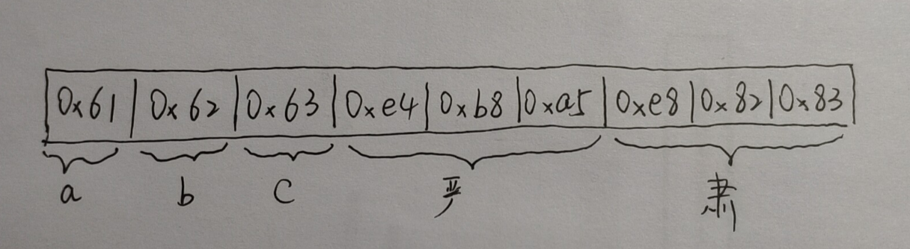

# 数据类型

### 查看和验证数据的类型

如果想查看某个[表达式](https://www.php.net/manual/zh/language.expressions.php)的值和类型，用 [var_dump()](https://www.php.net/manual/zh/function.var-dump.php) 函数。

如果只是想得到一个易读懂的类型的表达方式用于调试，用 [gettype()](https://www.php.net/manual/zh/function.gettype.php) 函数。要检验某个类型，*不要*用 [gettype()](https://www.php.net/manual/zh/function.gettype.php)，而用 *is_type* 函数。

### 浮点数

PHP 中不区分 float 和 double，如果需要高精度的计算，应该使用 [BC 数学函数](https://www.php.net/manual/zh/ref.bc.php) 或 [gmp函数](https://www.php.net/manual/zh/ref.gmp.php)。

> 理解计算机是如何存储浮点类型数据的

### 字符串

PHP 中的 [string](https://www.php.net/manual/zh/language.types.string.php) 的实现方式是一个由字节组成的数组再加上一个整数指明缓冲区长度。

##### 编码

字符串会被按照该脚本文件相同的编码方式来编码。我们知道，一般脚本文件都是以utf-8编码的，那么我们就来看一看字符串（英文和中文）到底在php中是如何存储的。

我们知道以utf8编码的一个字符占用1-4个字节，英文字符占用一个字节，中文字符一般占用3个字节。而由定义可知，字符串的内容是存在字节数组中的，所以字符串实际存储是以字节为单位的。

举个例子，比如：`$str = 'abc严肃'`。英文 `abc` 是单字节字符，对应的字节是 `0x61 0x62 0x63`，中文 `严肃` 是多字节字符，对应的字节分别是 `0xe4 0xb8 0xa5` `0xe8 0x82 0x83`。（此处可参考：[字符编码笔记：ASCII，Unicode 和 UTF-8](<http://www.ruanyifeng.com/blog/2007/10/ascii_unicode_and_utf-8.html>)）

所以字符串 `$str` 实际的存储如图所示：




但我们使用单字节函数时，就会得到以下结果：

```php
$str = 'abc严肃'
echo strlen($str); // output: 9
echo substr($str, 3, 1); // output：�，也许我们的本意是想取得‘严’这个字符，但是因为结果实际是取到了 0xe4 这个字节，但是无法以utf8反编码，只能是显示为乱码
```

其实这也解释了，为什么我们可以直接对中文字符串使用 '==' 进行比较，因为比较是基于字节进行的。

##### 与c语言字符串的区别：

在c语言中，字符串是以一个空字符 `\0` 结尾的，但是在php中，其值为 *0*（“NUL bytes”）的字节可以处于字符串任何位置。那php中如何界定字符串的结尾呢？这依赖于字符串的特殊结构：

```c
/*
gc: 变量引用信息,比如当前value的引用数,所有用到引用计数的变量类型都会有这个结构,3.1节会详细分析
h: 哈希值,数组中计算索引时会用到
len: 字符串长度,通过这个值保证二进制安全
val: 字符串内容,变长struct,分配时按len长度申请内存
事实上字符串又可具体分为几类:IS_STR_PERSISTENT(通过malloc分配的)、IS_STR_INTERNED(php代码里写的一些字面量,比如函数名、变量值)、IS_STR_PERMANENT(永久值,生命周期大于request)、IS_STR_CONSTANT(常量)、IS_STR_CONSTANT_UNQUALIFIED,这个信息通过flag保存:zval.value->gc.u.flags,后面用到的时候再具体分析. 
*/
struct _zend_string {
    zend_refcounted_h gc;
    zend_ulong        h;                /* hash value */
    size_t            len;
    char              val[1];
};
```

可以看到，结构中定义了字符串的长度 **len**，通过这个数值，就可以判断字符串是否已到结尾。

##### 二进制安全

我们经常会在php的手册中看到这么一句话：

> 此函数是二进制安全的

那二进制安全是指的什么呢？其实这要结合c语言的函数来说，我们知道c语言判定字符串结束的标志是空字符 `\0` 。所以，在 c 语言中字符串函数操作到空字符时就会忽略后面的字符。

于是，在c语言中 `strcmp("abc", "abc\0def")` 返回的结果是 0。

但是在php中，如果一个函数是二进制安全的，那么此函数只会把空字符视为普通的字符，于是 `strcmp("abc", "abc\0def")` 返回的结果是 -1。

因此，二进制安全的定义就是：

**程序不会对其中的数据做任何限制、过滤、或者假设 —— 数据在写入时是什么样的， 它被读取时就是什么样。**

可以参考：

[php手册经常见到，什么是“二进制安全”](<https://blog.csdn.net/zhuocr/article/details/70591310>)

[php的二进制安全](<https://blog.csdn.net/qq_28018283/article/details/79422536>)

##### 建议

更好的了解php字符串的方式，就是官方手册。